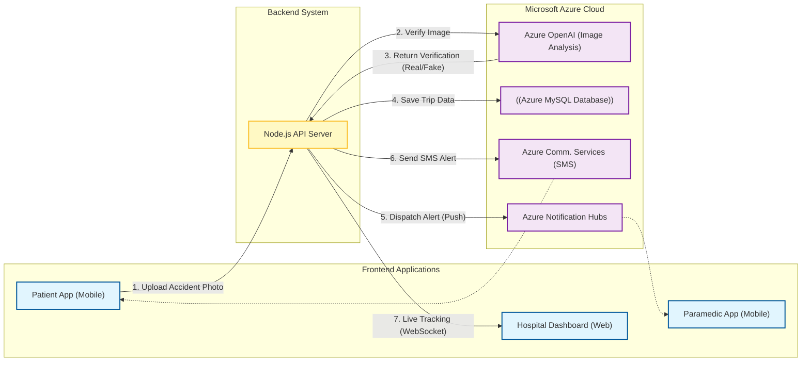

# Architecture Diagram (Imagine Cup 2025)

Copy the code below into [Mermaid Live Editor](https://mermaid.live/). This version uses strict quoting to avoid syntax errors and lays out clearly from Left to Right.

